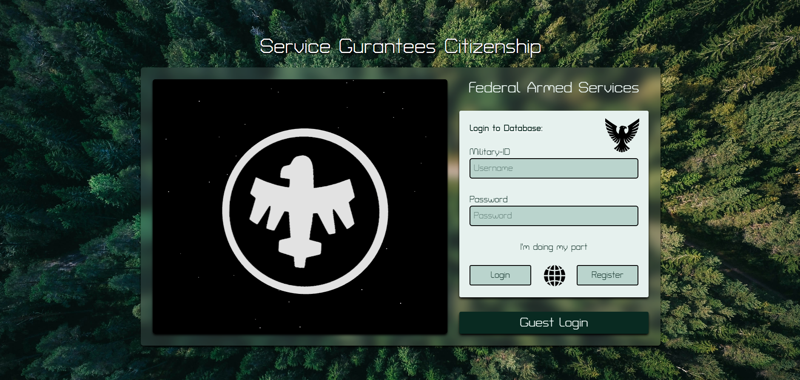
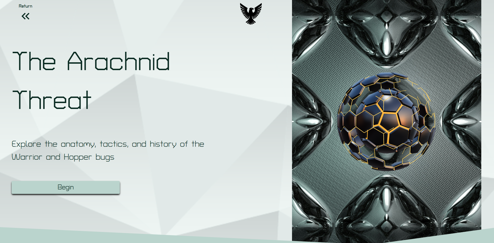
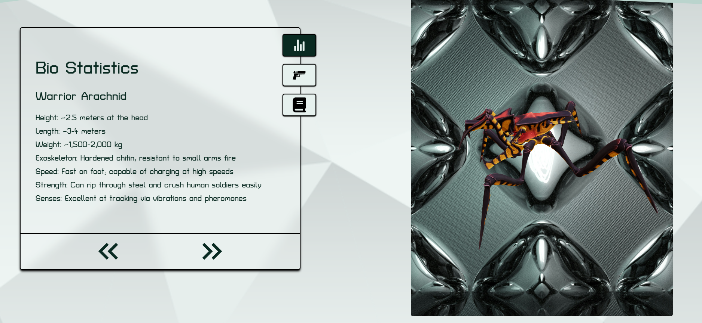

# Trooper Database

## A Play on Login Website that shows information about two 3d models of Arachnids - Hopper & Warrior. Made with Express and SQL(PostgreSQL) for the backend and React with Tailiwind for the Frontend

 - Deploying to netlify with the backend folder was giving errors so I used just the frontend folder.
 - The whole project repo can be found here [LoginSystemV1](https://github.com/TSEidolon/loginSystemV1)

p.s. Click the Guest Login Button on the Login Page to gain entry to the Main Area. Also backend only works locally 

Login Area

Main Area

Live Website:[Trooper Database](https://trooperdatabase-tseidolon.netlify.app/)

Mockup Made in Figma:[Figma Mockup](https://www.figma.com/design/DmLDTOt30LNPXfDNrb0ZKv/Login?node-id=0-1&t=xvk6YLf5h1J4gCat-1)

Attributions:
  - nthmn.exe - [GeometryNodes SciFi Sphere]()
  - Balazs Szeleczki - [Hopper Model](https://skfb.ly/oWXCT)
  - Balazs Szeleczki - [Warrior Model](https://skfb.ly/oWvXJ)
  - Geranimo - [Geranimo](https://unsplash.com/photos/aerial-shot-of-road-surrounded-by-green-trees-qzgN45hseN0)
  - Rothenberg - [Rothenberg](https://unsplash.com/photos/a-shiny-metal-surface-with-a-diamond-pattern-n17JKxJiTL8)
  - Freepik - [Chameleon Icon](https://www.flaticon.com/free-icon/chameleon_7336277?term=chameleon&page=1&position=76&origin=search&related_id=7336277)

Javascript Library
  - React JS 
  - ThreeJS 
  - React-three-fiber with React-three-drei
  - Express.js

Misc Tools
 - PostgreSQL
 - Tailwind CSS
